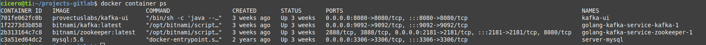
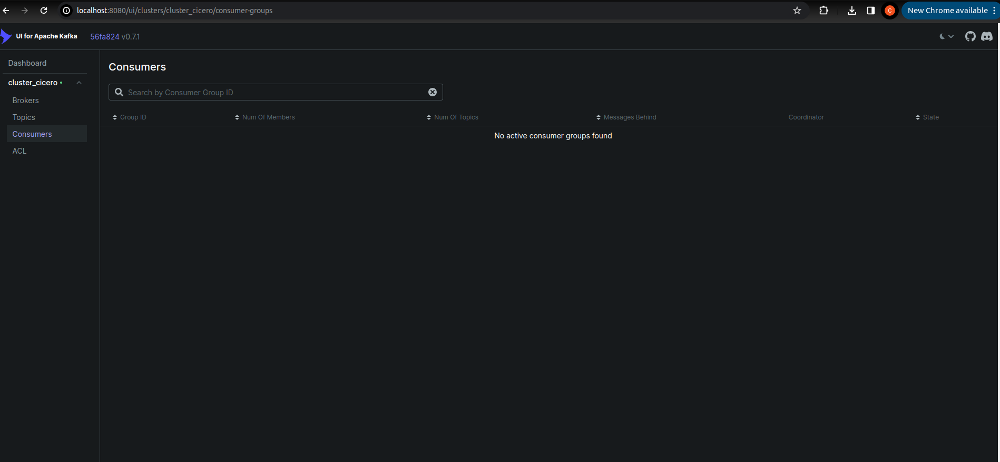
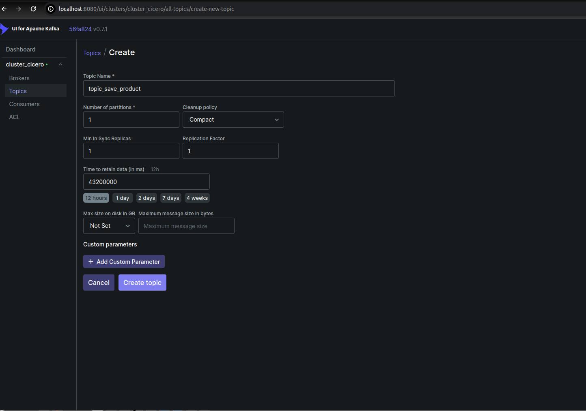
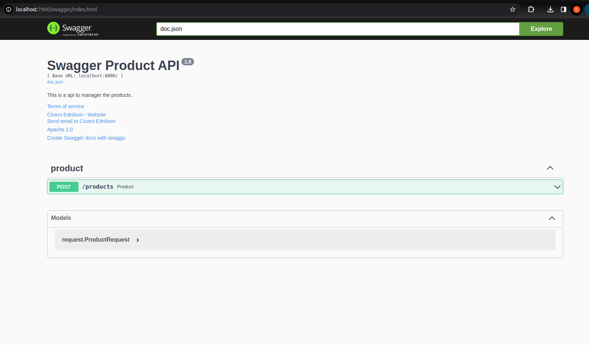
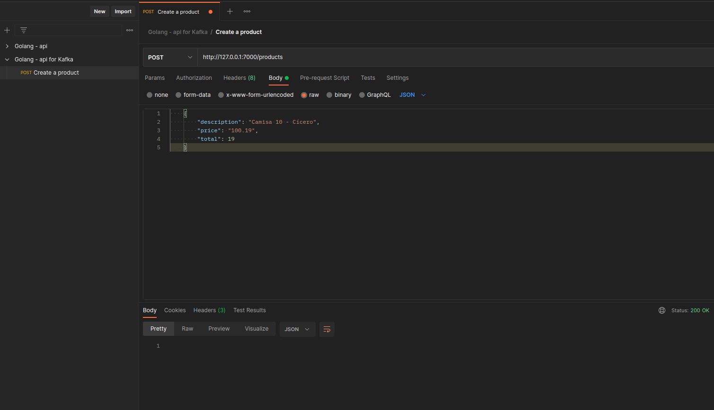
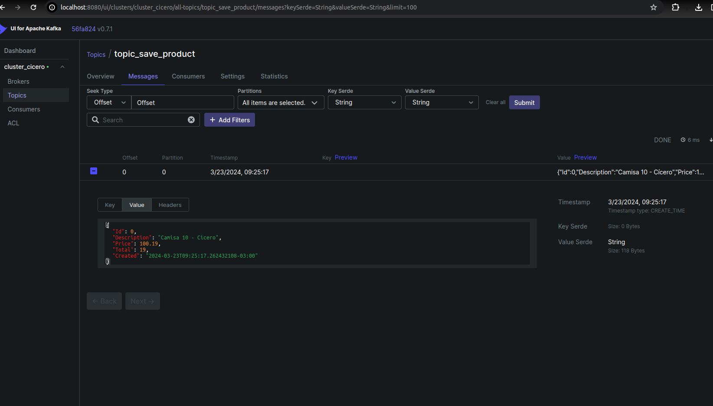
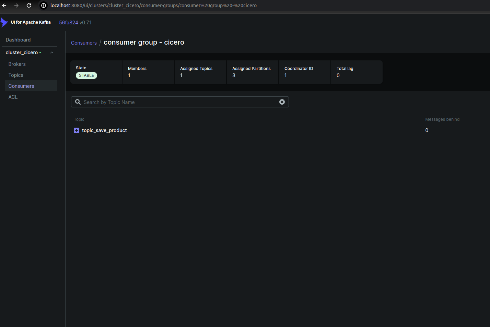
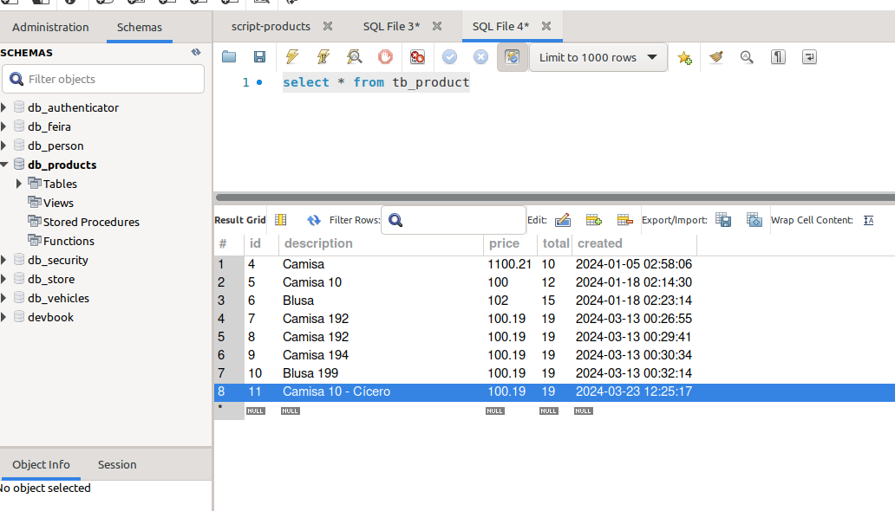

# Project to learn Golang and Apache Kafka.

I created a Producer and a Consumer for Apache Kafka using the Golang.   

## 🚀 Starting.

The principal objective of this project is to show how to use Golang with Apache Kafka.

## 🛠 Stack.

<ol>
  <li>Golang</li>
  <li>VsCode</li>
  <li>Postman</li>
  <li>Mysql</li>
  <li>Mysql Workbench</li>
  <li>Docker</li>
  <li>Docker compose</li>
  <li>Apache Kafka</li>
</ol>

## ⚙️ Architecture General.

## ⚙️ Architecture of Producer.

## ⚙️ Architecture of Consumer.

## ⚙️ Creating a Database on MySQL.

~~~~sql
CREATE DATABASE `db_products`;
~~~~

## ⚙️ Creating a Table on Database.

~~~~sql
CREATE TABLE IF NOT EXISTS tb_product(
   `id` 		   INT NOT NULL PRIMARY KEY AUTO_INCREMENT,
   `description`   VARCHAR(100) NOT NULL,
   `price`   	   FLOAT NOT NULL,
   `total`   	   INT NOT NULL,
   `created`   	   timestamp NOT NULL
);
~~~~

## ⚙ ️Execute the Docker compose to create your infrastructure with Kafka.

Path of file: ms-kafka-products-golang/docker-compose/docker-compose.yml

If you don't have a Docker compose installed on your PC, you shall follow the steps below.

~~~~shell
curl -SL https://github.com/docker/compose/releases/download/v2.24.6/docker-compose-linux-x86_64 -o /usr/local/bin/docker-compose

sudo ln -s /usr/local/bin/docker-compose /usr/bin/docker-compose

chmod +x /usr/local/bin/docker-compose
~~~~

Execute the command below to create of the infrastructure.

~~~~shell
sudo docker-compose up -d --build
~~~~

If you don't have MySQL installed, you need to execute the commands below to create a container of MySQL.

~~~~shell
docker pull mysql
~~~~

~~~~shell
docker run -p 3306:3306 --network=ciceroednilson --hostname base-mysql --name base-mysql -e MYSQL_ROOT_PASSWORD=123456 -d mysql:latest
~~~~

After you execute the command of Docker compose, you shall see the containers below.

## ⚙️ UI for Apache Kafka.

If everything is executing successfully, you can see this UI for Apache Kafka

[http://localhost:8080/](http://localhost:8080/)

## ⚙️ Create a new Topic.

this new Topic, we go to use to posts and consume some messages.

## ⚙️ Creating Swagger of files in the project of the Producer.

~~~~shell
swag init -g cmd/main.go handlers/producthandler/producthandler.go
~~~~

## ⚙️ Swagger of the Producer.

~~~~shell
swag init -g cmd/main.go handlers/producthandler/producthandler.go 
~~~~

## ⚙️ Download the dependencies.

Execute this command in the root directory of two applications(ms-products-producer-golang and ms-products-consumer-golang).
~~~~shell
go mod tidy
~~~~

## ⚙️ Execute the command below in two projects to start applications.

~~~~shell
 go run cmd/main.go
~~~~

## ⚙️ Test with Postman.

## ⚙️ Message on the Topic.

After you post a message, you shall see in UI of Kafka.

## ⚙️ See your consumer on Apache Kafka.

## ⚙️ See your information on the Database..

## 📌 Documentation swaggo

https://github.com/swaggo/http-swagger

## 📌 Version.

1.0

## ✒️ Author.

Cícero Ednilson - ciceroednilson@gmail.com
