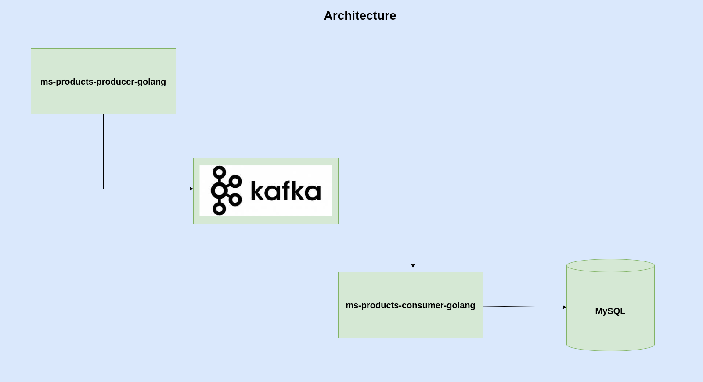
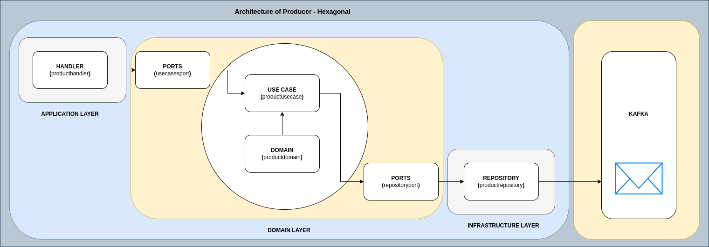

# Project to learn Golang and Apache Kafka.

I created a Producer and a Consumer for Apache Kafka using the Golang.   

## 🚀 Starting.

The principal objective of this project is to show how to use Golang with Apache Kafka.

## 🛠 Stack.

<ol>
  <li>Golang</li>
  <li>VsCode</li>
  <li>Postman</li>
  <li>Mysql</li>
  <li>Mysql Workbench</li>
  <li>Docker</li>
  <li>Docker compose</li>
  <li>Apache Kafka</li>
</ol>

## ⚙️ Architecture General.

## ⚙️ Architecture of Producer.

## ⚙️ Architecture of Consumer.

