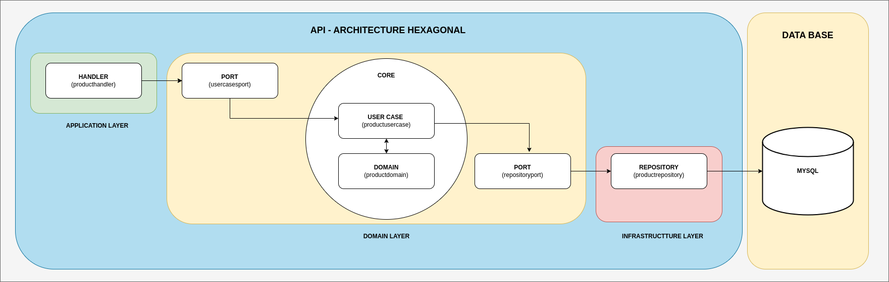
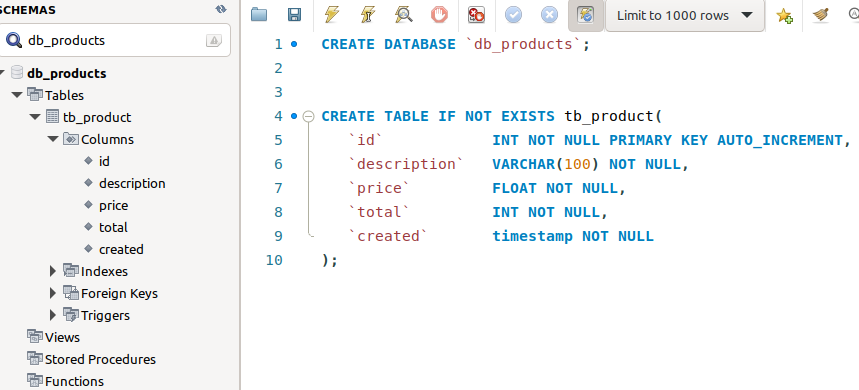
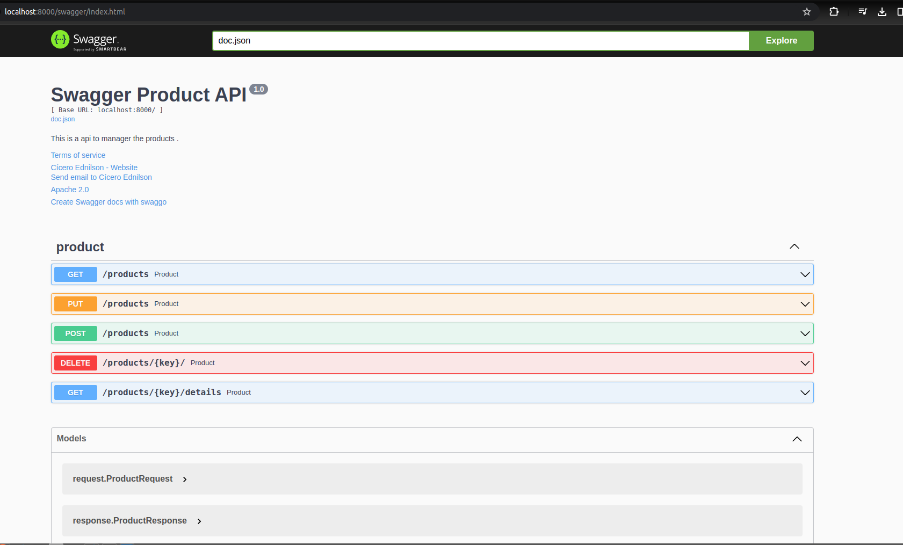
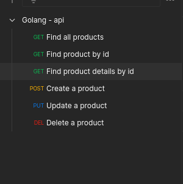
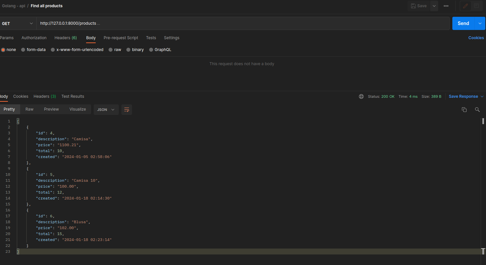
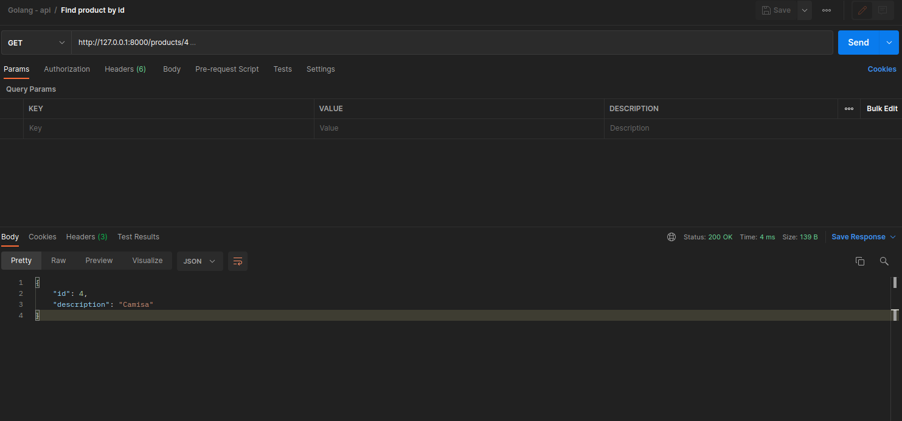
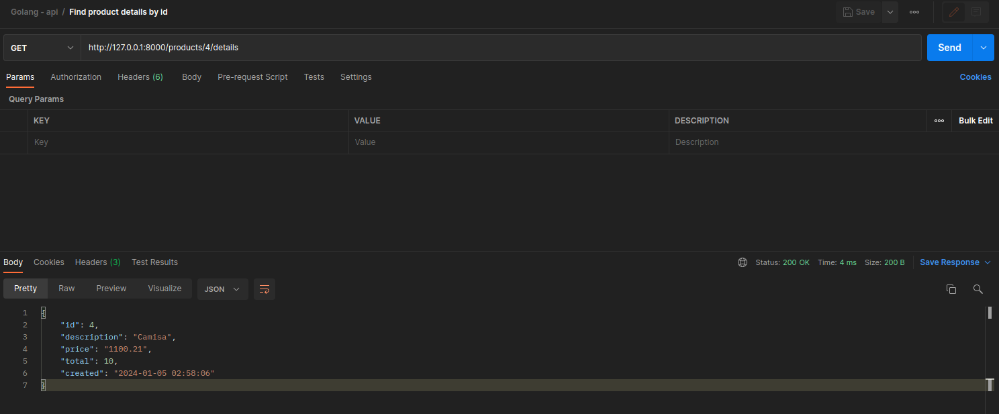
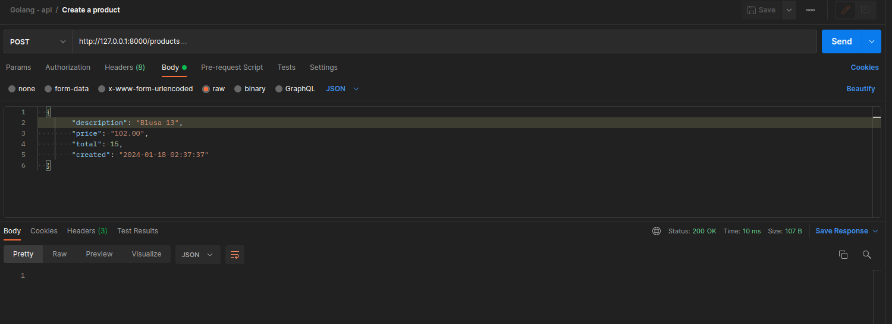
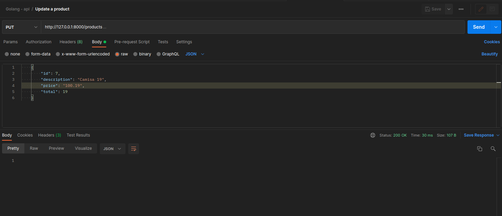
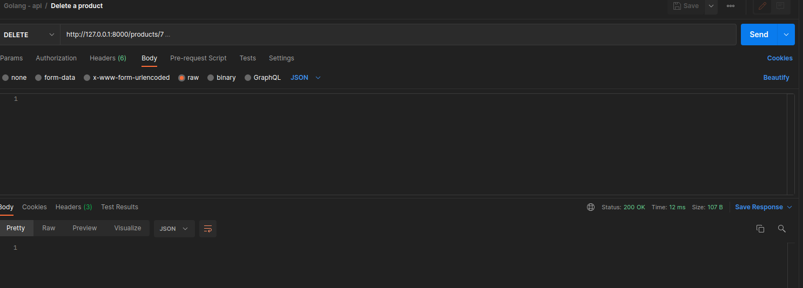

# Project to learn Golang.

Creating a Crud of the product. 

## 🚀 Starting.

The principal objective of this project is to show how the use Golang on a hexagonal architecture. 

## 🛠 Stack.

<ol>
  <li>Golang</li>
  <li>VsCode</li>
  <li>Postman</li>
  <li>Mysql</li>
  <li>Mysql Workbench</li>
  <li>Docker</li>
</ol>

## ⚙️ Architecture.

## ⚙️ Structure.

## ⚙️ Data Base.

## ⚙️ Creating a Database on MySQL.

~~~~sql
CREATE DATABASE `db_products`;
~~~~

## ⚙️ Creating a Table on Databsse.

~~~~sql
CREATE TABLE IF NOT EXISTS tb_product(
   `id` 		   INT NOT NULL PRIMARY KEY AUTO_INCREMENT,
   `description`   VARCHAR(100) NOT NULL,
   `price`   	   FLOAT NOT NULL,
   `total`   	   INT NOT NULL,
   `created`   	   timestamp NOT NULL
);
~~~~

## ⚙️ Download the dependencies.

~~~~shell
go mod tidy
~~~~

## ⚙️ Executing the project.

~~~~shell
 go run cmd/main.go
~~~~

## ⚙️ Swagger.

 * [http://localhost:8000/swagger/index.html](http://localhost:8000/swagger/index.html)

## ⚙️ Test with Postman - Collection.

 * [docs_readme/postman_collection.json](docs_readme/postman_collection.json)

## ⚙️ Test with Postman - Find all products.

## ⚙️ Test with Postman - Find product by id.

## ⚙️ Test with Postman - Find product details by id.

## ⚙️ Test with Postman - Create a product.

## ⚙️ Test with Postman - Update a product.

## ⚙️ Test with Postman - Delete a product.

## ✒️ Help to add Swagger to a new project.

Install a dependency. 

~~~~shell
 go install github.com/swaggo/swag/cmd/swag@latest
~~~~

Edit the profile.

~~~~shell
vi ~/.profile 
~~~~

Case no exists the command below, add the line on the profile file. 

~~~~shell
export PATH=$(go env GOPATH)/bin:$PATH
~~~~

Reload the file.

~~~~shell
source ~/.profile 
~~~~

Creating Swagger of files.

~~~~shell
swag init -g cmd/main.go handlers/producthandler/producthandler.go 
~~~~

## 📌 Documentation swaggo

https://github.com/swaggo/http-swagger

## 📌 Version.

1.0

## ✒️ Author.

Cícero Ednilson - ciceroednilson@gmail.com
